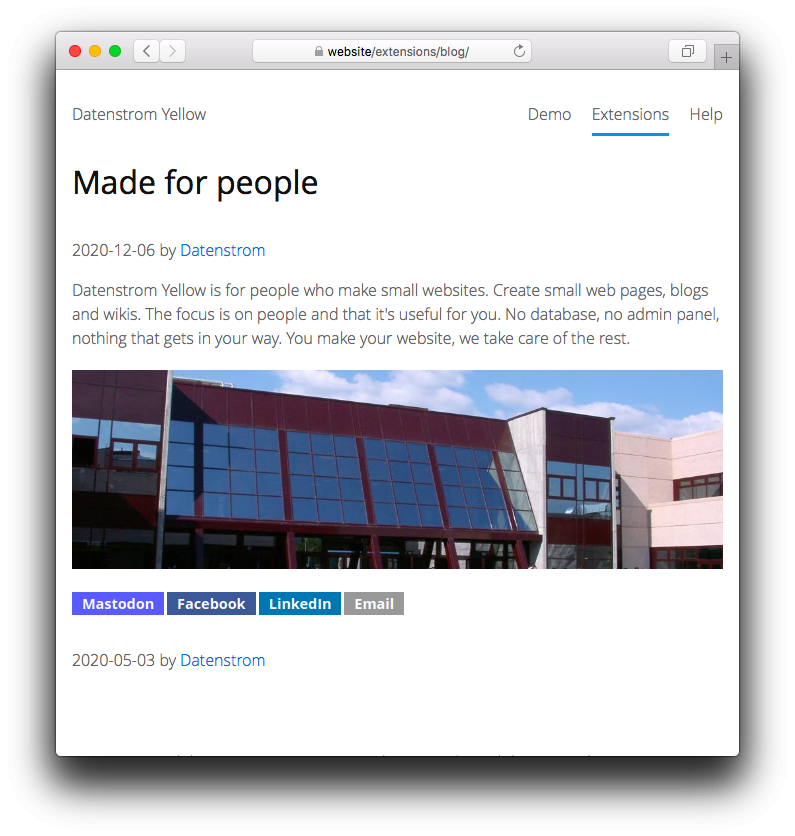

# Minishare 0.9.2

Social sharing links.

<p align="center"></p>

## How to install an extension

[Download ZIP file](https://github.com/GiovanniSalmeri/yellow-minishare/archive/refs/heads/main.zip) and copy it into your `system/extensions` folder. [Learn more about extensions](https://github.com/annaesvensson/yellow-update).

## How to show sharing links

This extension adds sharing links for popular social media sites. Links are shown on blog pages. To show links on other pages use a `[minishare]` shortcut. It's recommended to install the [meta extension](https://github.com/annaesvensson/yellow-meta), it allows you to set additional meta data for social media sites.

If you want to customise sharing links with CSS, write a `minishare-custom.css` file, put it into your `system/themes` folder, open file `system/extensions/yellow-system.ini` and change `MinishareStyle: custom`.

## Examples

Content file with sharing links:

    ---
    Title: Example page
    ---
    Lorem ipsum dolor sit amet, consectetur adipisicing elit, sed do eiusmod tempor incididunt ut 
    labore et dolore magna pizza. Ut enim ad minim veniam, quis nostrud exercitation ullamco laboris 
    nisi ut aliquip ex ea commodo consequat. Duis aute irure dolor in reprehenderit in voluptate velit 
    esse cillum dolore eu fugiat nulla pariatur. Excepteur sint occaecat cupidatat non proident, sunt 
    in culpa qui officia deserunt mollit anim id est laborum.

    [minishare]

Layout file with sharing links:

    <?php $this->yellow->layout("header") ?>
    <div class="content">
    <div class="main" role="main">
    <h1><?php echo $this->yellow->page->getHtml("titleContent") ?></h1>
    <?php echo $this->yellow->page->getContentHtml() ?>
    <?php echo $this->yellow->page->getExtraHtml("minishare") ?>
    </div>
    </div>
    <?php $this->yellow->layout("footer") ?>

Configuring different sharing services in the settings:

```
MinishareServices: facebook, x, linkedin, reddit, email
MinishareServices: mastodon, linkedin, email
```

## Settings

The following settings can be configured in file `system/extensions/yellow-system.ini`:

`MinishareServices` = social sharing services, all lowercase  
`MinishareStyle` = link style, e.g. `plain`, `squared`, `rounded`  

The following file can be customised:

`system/extensions/minishare.csv` = supported social services  

The following placeholders for social services share links are supported:

`@url` = page URL  
`@title` = page title  
`___INSTANCE___` = instance URL for decentralised services  

## Developer

Giovanni Salmeri. [Get help](https://datenstrom.se/yellow/help/).
